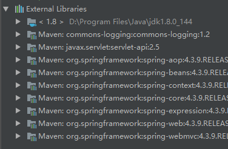

Maven 初步
=========

在进一步介绍 SpringMVC 之前我们首先了解一下 Java 生态系统的另一个重要组成部分——构建和包管理。这部分目前以 Gradle 和 Maven 两大工具为主。这个教程将使用 Maven 作为例子。

Maven 是一个非常强大的 Java 构建工具，包含了依赖管理，版本维护，自动化构建等诸多功能，这里我们将主要使用它的依赖管理功能。

首先打开工程，在 Project Settings 里去掉我们之前添加的诸多依赖 jar 包。我们将使用 Maven 管理这些依赖。

在工程名字上右键点击，选择“Add Framework Support”。在打开的对话框中，勾选 Maven，然后点击确定。

工程中将会出现一个 `pom.xml` 文件，它的全称是 project object model，是 Maven 当中用来描述项目信息的一个文件：

```xml
<?xml version="1.0" encoding="UTF-8"?>
<project xmlns="http://maven.apache.org/POM/4.0.0"
         xmlns:xsi="http://www.w3.org/2001/XMLSchema-instance"
         xsi:schemaLocation="http://maven.apache.org/POM/4.0.0 http://maven.apache.org/xsd/maven-4.0.0.xsd">
    <modelVersion>4.0.0</modelVersion>

    <groupId>MyJavaWebProject</groupId>
    <artifactId>MyJavaWebProject</artifactId>
    <version>1.0-SNAPSHOT</version>

</project>
```

可以看到，这个 POM 文件就是描述我们当前使用的项目的，其中 groupId 是项目组编号，artifactId 是项目 ID，而 version 是项目的版本。

下面我们引入我们需要的依赖，在 `pom.xml` 当中加入以下内容：

```xml

<?xml version="1.0" encoding="UTF-8"?>
<project xmlns="http://maven.apache.org/POM/4.0.0"
         xmlns:xsi="http://www.w3.org/2001/XMLSchema-instance"
         xsi:schemaLocation="http://maven.apache.org/POM/4.0.0 http://maven.apache.org/xsd/maven-4.0.0.xsd">
    <modelVersion>4.0.0</modelVersion>

    <properties>
        <maven.compiler.target>1.8</maven.compiler.target>
        <maven.compiler.source>1.8</maven.compiler.source>
    </properties>

    <groupId>MyJavaWebProject</groupId>
    <artifactId>MyJavaWebProject</artifactId>
    <version>1.0-SNAPSHOT</version>

    <dependencies>
        <dependency>
            <groupId>org.springframework</groupId>
            <artifactId>spring-webmvc</artifactId>
            <version>4.3.9.RELEASE</version>
        </dependency>

        <dependency>
            <groupId>javax.servlet</groupId>
            <artifactId>servlet-api </artifactId>
            <version>2.5</version>
        </dependency>

    </dependencies>
</project>
```

可以看到，我们对于依赖的描述，本质上也是对于一个项目的描述，和描述我们自己类似。通过这些信息，Maven 可以在中心仓库中找到正确的依赖项目并引入到我们的工程当中。

IDEA 会提示我们 POM 文件改变，选择“Import Changes”，会看到有关的依赖被加入到了 “External Library” 中：



如果导入过程非常慢，那么可能是网络条件不良，我们可以修改中心仓库的地址，使用国内的 Maven 镜像。

在 File -> Settings 中找到 Build Tools，选择 Maven，可以看到 Maven 本地的配置地址，即 User settings file。在 settings.xml 这个文件中加入国内的镜像，例如 alibaba 提供的镜像地址，可以加快 Maven 的下载速度。