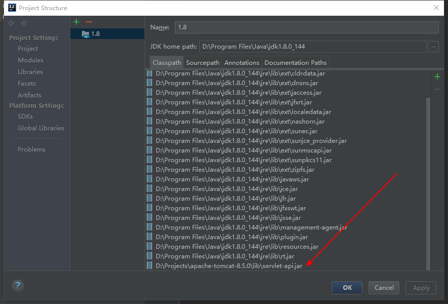
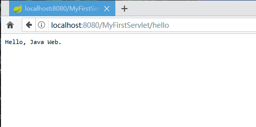

## 第一个 JavaEE 应用程序

JavaEE 是 Java Web 开发当中事实上的标准，诸多框架也都是建立在 JavaEE 的 API 基础之上的。为了从头理解 Java Web 开发，我们将一步一步地，从一个最简单的 JavaEE Servlet 应用开始，一步一步进入 Java Web 开发的世界。

#### 准备工作

要完成这个教程，你只需要有网络就可以了，首先下载 IntelliJ IDEA Community 版。没错，我们就是故意要使用 Community 版，尽管 Utimate 版对 JavaEE 开发的支持更好，但是更好的工具却可能让我们忽略底层的细节。Community 版对于入门来说已经足够。

然后你需要下载 JavaSE 的 JDK，也就是大家使用最多的 JDK 版本。示例使用的 1.8.0 版本。

最后你需要一个 Servlet Container，去 Tomcat 网站下载一个版本，主要要和 JDK 的版本要求相匹配。示例使用的是 Tomcat 8.5.0。

#### 第一个 Servlet

首先创建一个工程，选择好 JDK 版本，一路 Next 就可以了。创建好工程之后，我们创建一个新的 Servlet。首先在左边的 src 上右键创建一个 package，然后在 package 上右键，创建一个 Java Class：

```java
package com.skyline;

import javax.servlet.*;
import java.io.IOException;
import java.io.PrintWriter;

public class MyFirstServlet implements Servlet {
    public void init(ServletConfig config) throws ServletException {
        System.out.println("Init");
    }

    public void service(ServletRequest request, ServletResponse response)
            throws ServletException, IOException {
        System.out.println("From service");
        PrintWriter out = response.getWriter();
        out.println("Hello, Java Web.");
    }

    public void destroy() {
        System.out.println("Destroy");
    }

    public String getServletInfo() {
        return null;
    }

    public ServletConfig getServletConfig() {
        return null;
    }
}
```

这时候代码上会报很多错误，核心原因是 `javax.servlet` 这个包找不到。前面提的过 Servlet API 是包含在 JavaEE 当中的。为了方便，我们直接使用 Tomcat 附带的 servlet-api.jar 包。在 IDEA 中打开 Library Settings（External Libraries 下面的任意一项右键 -> Open Library Settings，在 Classpath 中加入 servlet-api.jar：



这时工程应该可以正常通过编译了。

#### 部署

为了让 Servlet 跑起来，我们需要把它部署到 Tomcat 上。首先在 src 目录隔壁，创建一个 `WEB-INF` 目录（注意名字一定要正确），然后在里面创建一个 `web.xml` 文件：

```xml
<?xml version="1.0" encoding="UTF-8"?>
<web-app version="2.4" xmlns="http://java.sun.com/xml/ns/j2ee"
         xmlns:xsi="http://www.w3.org/2001/XMLSchema-instance"
         xsi:schemaLocation="http://java.sun.com/xml/ns/j2ee
http://java.sun.com/xml/ns/j2ee/web-app_2_4.xsd">

    <servlet>
        <servlet-name>MyFirstServletName</servlet-name>
        <servlet-class>com.skyline.MyFirstServlet</servlet-class>
    </servlet>

    <servlet-mapping>
        <servlet-name>MyFirstServletName</servlet-name>
        <url-pattern>/hello</url-pattern>
    </servlet-mapping>
</web-app>
```

可以看到 `web.xml` 的作用是告诉 Tomcat，我们想使用哪个 Servlet 来处理对应的请求。Tomcat 通过 `web.xml` 找到对应的 Servlet 完成请求以及响应过程。

下面是具体的部署过程。首先找到 Tomcat 的目录，其中有一个 webapps 文件夹，在里面创建一个新的 MyFirstServlet 文件夹，然后把整个 `WEB-INF` 文件夹拷贝过去，此时的目录结构应该是这样的：

```plaintext
webapps
  - MyFirstServlet
    - WEB-INF
      - web.xml
```

下一步，将 IDEA 编译出的产物（默认应该在 out 文件夹中），把 package 结构已经对应的产物拷贝到 `WEB-INF` 中的 `classes` 文件夹里，完成之后的目录结构应该是这样的：

```plaintext
webapps
  - MyFirstServlet
    - WEB-INF
      - classes
        - com
          - skyline
            - MyFirstServlet.class
      - web.xml
```

#### 运行

完成部署工作之后，需要启动 Tomcat 服务器。找到 Tomcat 目录中的 bin 文件夹，使用 cmd 运行其中的  startup.bat。如果提示没有设置 `JAVA_HOME` 或 `JRE_HOME`，需要到环境变量中设置一下。完成设置之后，Tomcat 应该可以正常启动。

然后在任意一个浏览器当中，访问 http://localhost:8080/MyFirstServlet/hello 可以看到结果：

